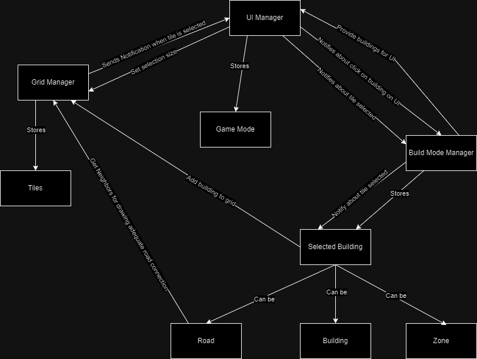

# Architecture

## Diagram

## Description
The main game is currently centered around 3 main scripts **Grid Manager**, **UI Manager** and **Build Mode Manager**.

### [Grid Manager](../Assets/Code/Scripts/GridManager.cs)
Stores all the tiles and sends notifications when a tile is selected to the **UI Manager**. 

### [UI Manager](../Assets/Level/UI/GameUIManager.cs) 
Stores the current game mode. 

Creates the UI for building mode. When creating the building mode UI it asks the Build Mode Manager to get all the buildings. It also notifies the Build Mode Manager if a building is selected on the UI. 

When a new Builiding is selected the UI manager notifies the Grid Manager that the selection size has changed. 

When the game is in Build mode and the Grid Manager sends a notification that a tile is selected, the UI Manager propagates the info to the Building Manager.

### [Build Mode Manager](../Assets/Code/Scripts/BuildMode/BuildModeManager.cs)
Stores the current selected building to be built. Also provides info about the available buildings to the UI Manager.

When a tile is selected notification is propagated to the Build Mode Manage it propagetes this information to the selected building so it can place itself. The buildings notify the Grid Manager that they want to be placed at a certain position and the grid manager stores this information. 